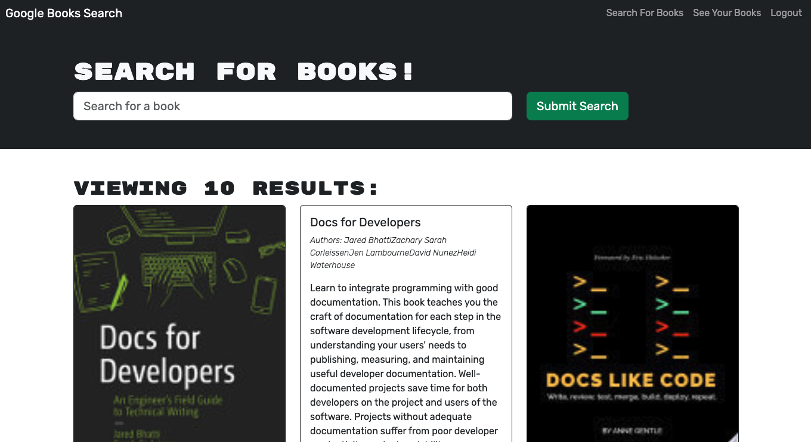

# Book Search Engine

## Description

Google Books API search engine that utalizes GraphQL API built with Apollo Server. The app was built using the MERN stack, with a React front end, MongoDB database, and Node.js/Express.js server and API. The app allows users to create a login, search for books, and save book searches to the back end.

### User Story
AS AN avid reader
I WANT to search for new books to read
SO THAT I can keep a list of books to purchase

### Acceptance Criteria
GIVEN a book search engine
- WHEN I load the search engine
- THEN I am presented with a menu with the options Search for Books and Login/Signup and an input field to search for books and a submit button
- WHEN I click on the Search for Books menu option
- THEN I am presented with an input field to search for books and a submit button
- WHEN I am not logged in and enter a search term in the input field and click the submit button
- THEN I am presented with several search results, each featuring a book’s title, author, description, image, and a link to that book on the Google Books site
- WHEN I click on the Login/Signup menu option
- THEN a modal appears on the screen with a toggle between the option to log in or sign up
- WHEN the toggle is set to Signup
- THEN I am presented with three inputs for a username, an email address, and a password, and a signup button
- WHEN the toggle is set to Login
- THEN I am presented with two inputs for an email address and a password and login button
- WHEN I enter a valid email address and create a password and click on the signup button
- THEN my user account is created and I am logged in to the site
- WHEN I enter my account’s email address and password and click on the login button
- THEN I the modal closes and I am logged in to the site
- WHEN I am logged in to the site
- THEN the menu options change to Search for Books, an option to see my saved books, and Logout
- WHEN I am logged in and enter a search term in the input field and click the submit button
- THEN I am presented with several search results, each featuring a book’s title, author, description, image, and a link to that book on the Google Books site and a button to save a book to my account
- WHEN I click on the Save button on a book
- THEN that book’s information is saved to my account
- WHEN I click on the option to see my saved books
- THEN I am presented with all of the books I have saved to my account, each featuring the book’s title, author, description, image, and a link to that book on the Google Books site and a button to remove a book from my account
- WHEN I click on the Remove button on a book
- THEN that book is deleted from my saved books list
- WHEN I click on the Logout button
- THEN I am logged out of the site and presented with a menu with the options Search for Books and Login/Signup and an input field to search for books and a submit button  

Through this project I learned the different structures between a RESTful API app and a GraphQL API app that uses an Apollo Server.

## Table of Contents

- [Installation](#installation)
- [Usage](#usage)
- [Credits](#credits)
- [License](#license)

## Installation

To use this prgram visit the deployed URL and follow the instructions below.

- Deployed URL Link: https://book-search-engine-70lp.onrender.com/
- GitHub Repository: https://github.com/ahgeak/book_search_engine

## Usage

To use this program, follow these steps:
1. Visit the deployed URL link to run the app within your web browser
2. Click the `Login/Sign Up` button
3. Enter your information to create an account
4. Click the `Search For Books` button
5. Search for books you are interested in reading
6. Click the `Save this Book!` button
7. To review a list of your saved books click the `See Your Books` button

Screenshot of program:

## Credits

I created this program using the knowledge from my bootcamp and attended office hours and a tutoring session.

## License

This project uses an MIT License.
